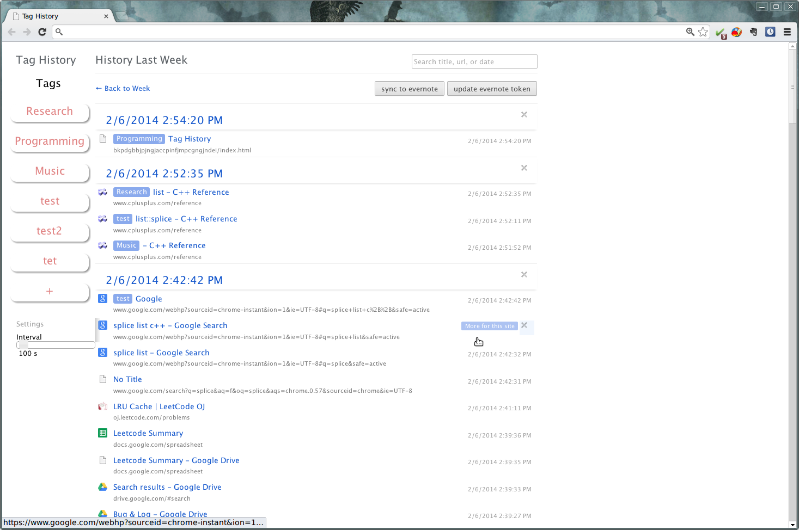

taghistory
==========

A chrome extension for tagging browsing history and export to Evernote. 

Introduction
===========
Do you have the following experiences?  
    - You want to revisit an interesting website that you came across before;
       However, you couldn't remember its address.  Have you ever wondered what
       you in
    - You have spent a whole day on the web without don't any thing. You feel guilty when you go to bed.

These situations can be avoided if you keep note of your own browsing history!
We should learn from Stephen Wolfram to be a more efficient and organized
person. Read his blog [here](http://blog.stephenwolfram.com/2012/03/the-personal-analytics-of-my-life/).

This chrome extension is to help you to manage your browsing history. After installing this tool, 
    - you simply drag and drop your each browsing record to corresponding tags;
    - you can tag browsing records in a batch mode. Similar browsing records are grouped
      intelligently. You can tag each group at the same time. The tool also
      provides ways to tune the parameters for the algorithm that groups
      records.
    - You can also export all your tags into Evernote™ service.

Screenshot
===========

